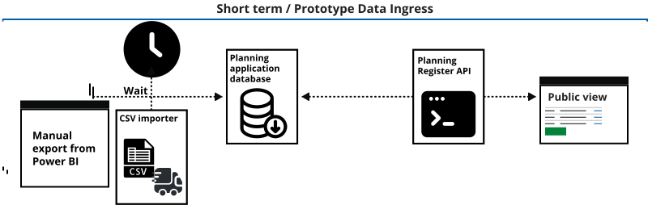
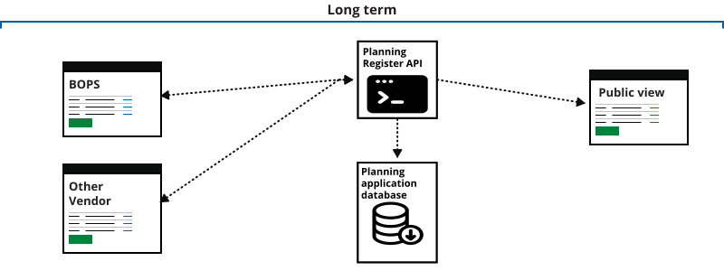

  

    

      

        <h1 class="app-hero__title">
          Find historical and current planning data 
        </h1>
        

          A platform to help you create services using planning data.
        

      

      

        

          
        

      

    

  

<strong class="govuk-tag govuk-!-margin-top-4 govuk-!-margin-bottom-2">Updated: JAN 2022</strong>

Our Planning Register system will provide an open platform to store, analyse and access planning data in a uniform way. 
The system will include an API as well as other tools to ensure that all legacy data is accessible. 
We are working with councils and other stakeholders to develop a reliable, efficient register prototype.

## Historical data

We are working with several councils to look at their historical data, and how we can take this data from various sources and put it in a database.
We are developing methods of doing this in the short term, and working on long-term plans of doing this through an API.

### Short term

In the short term, and almost certainly for the lifetime of this prototype, data will be extracted from existing tools. 
The main tool currently used to extract planning data at Lambeth and Southwark councils is PowerBI. 
For now, we will work with CSV data extracted from this.

### Long term

We want other organisations to use our API to send us the historical data.

## Database schema

We are opening up our intended database schema to try to capture all of the relevant available historical and related data. Please note we have not included document metadata or planning conditions and their relations - we are working on including this. We are welcoming comments on this schema. 

#### `addresses`

| Name | Type | Description | Relation |
| ----- | ----- | ----- | ----- |
| id | bigint | 
| full | string |
| town | string |
| postcode | string |
| map_east | string | 
| map_north | string | 
| created_at | datetime |
| updated_at | datetime |
| ward_code | string |
| ward_name | string |
| latitude | string |
| longitude | string |
| property_id | bigint | properties.id

#### `local_authorities`

| Name | Type |
| ----- | ----- 
| id | bigint |
| name | string |
| created_at | datetime |
| updated_at | datetime |

#### `planning_applications`

| Name | Type | Description |
| ----- | ----- | ----- | 
| id | bigint |
| reference | string |
| area | string |
| description | string |
| received_at | datetime |
| created_at | datetime |
| updated_at | datetime |
| assessor | string |
| decision | string |
| decision_issued_at | datetime |
| local_authority_id | bigint | 
| view_documents | string |
| application_type | string |
| reviewer | string |
| validated_at | datetime |
| created_at | datetime |
| updated_at | datetime |
| view_documents | string |
| application_type_code | string |

#### `planning_applications_properties`

| Name | Type | Relation |
| ----- | ----- | ----- |
| id | bigint |
| planning_application_id | bigint | planning_applications.id
| property_id | bigint | properties.id
| created_at | datetime |
| updated_at | datetime |

#### `properties`

| Name | Type | Description |
| ----- | ----- | ----- |
| id | bigint |
| uprn | string |
| type | string |
| code | string |
| created_at | datetime |
| updated_at | datetime |

## API Docs

We are building the API in this prototype. [View the API Docs / Swagger](api-docs).